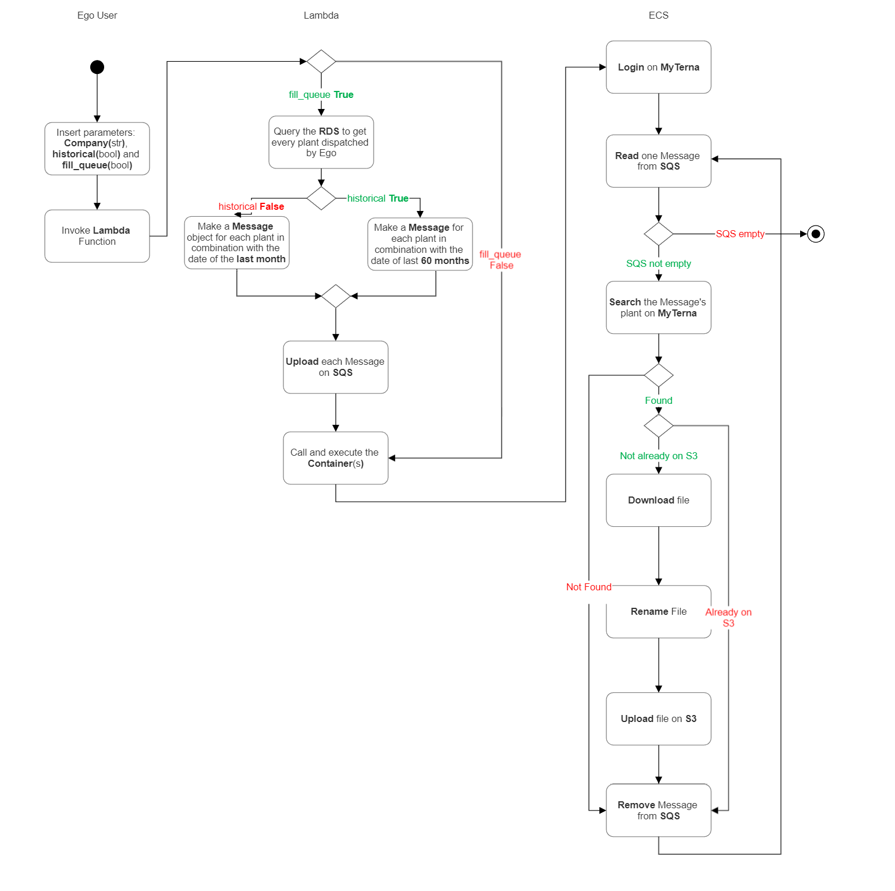
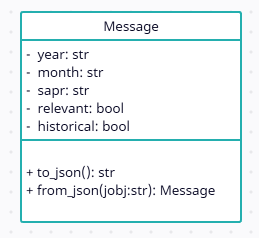

# Web Scraper per download dati dal sito di Terna

## Design Requirement Specification Document


<div align='right'> <br> Simone Palladino <br> Edoardo Bianco  </div>

### REVISION HISTORY

Version | Data | Author(s)| Notes
---------|------|--------|------
1.0 | 14/01/2023 | Edoardo Bianco | First Draft
1.1 | 21/03/2023 | Simone Palladino | Second Draft
2.0 | 03/04/2023 | Simone Palladino | First Version
3.0 | 13/04/2023 | Simone Palladino | Added Section 3 

## Table of Content

1. [Introduzione](#intro)
    1. [Scopo e Intenti](#purpose)  
    2. [Definizioni](#def)
    3. [Bibliografia](#biblio)
2. [Project Description](#description)
    1. [Project Introduction](#project-intro)
    2. [Technologies used](#tech)
    3. [Assumptions and Constraints](#constraints)
3. [System Overview](#system-overview)
    1. [System Architecture](#architecture)
    2. [System Data](#data)
        1. [System Inputs](#inputs)
        2. [System Outputs](#outputs)
    3. [Lamda](#lambda)
    4. [ECS](#ecs)
        1. [Message](#message)
        2. [Database](#database)
        3. [Meta_data_parser](#meta_data_parser)
        4. [Main](#main)

##  <a name="intro"></a>  1 Introduzione
    
### 1.1 Scopi e intenti
Lo scopo di questo algoritmo è quello di scansionare il vecchio sito web di [Terna](https://myterna.terna.it/portal/portal/myterna) per poter scaricare da esso dati relativi agli impianti di produzione energetici.
In particolare il codice si occupa di prendere i dati necessari al calcolo del conguaglio dal sito di Terna, per conto delle società Ego Data ed Ego Energye e di gestire le problematiche del sito durante lo scraping, essendo particolarmente datato, rendendo il sistema affidabile e robusto. 
<a name="purpose"></a> 


### <a name="def"></a> 1.2 Definizioni 
| First Header  | Second Header |
| ------------- | ------------- |
| AWS  | Amazon Web Services  |
| S3  | Amazon Simple Storage Service  |
| SQS | Amazon Simple Queue Service  |
| ECS | Amazon Elastic Container Service  |
    


###  1.3 Bibliografia
<details> 
<summary> Librerie
</summary>
    <ul>
    <li><a href="https://boto3.amazonaws.com/v1/documentation/api/latest/index.html">API per lavorare con i servizi di AWS</a></li>
    <li><a href="https://pypi.org/project/watchdog/">Watchdog che fornisce API per il monitoring dei file systems</a></li>
    <li><a href="https://www.selenium.dev/documentation/webdriver/ ">Selenium</a></li>
    <li><a href="https://aws.amazon.com/it/sqs/">Amazon SQS per il servizio di code fornito da Amazon</a></li>
    <li><a href="https://aws.amazon.com/it/ecs/">Amazon ECS per il servizio di container di Amazon</a></li>
    <li><a href="https://aws.amazon.com/it/s3/">Amazon S3 per il servizio di storing di Amazon</a></li>
    <li><a href="https://docs.python.org/3/library/os.html"> Python OS</a></li>
    <li><a href="https://docs.python.org/3/library/re.html">Python Regex</a></li>
    <li><a href="https://docs.python.org/3/library/datetime.html">Python Datetime</a></li>
    <li><a href="https://dateutil.readthedocs.io/en/stable/relativedelta.html">Python Relativedelta</a></li>
    <li><a href="https://docs.python.org/3/library/time.html">Python Time</a></li>
    </ul>
    
</details>
<a name="biblio"></a>

## <a name="description"></a> 2 Descrizione del progetto

### 2.1 Introduzione al progetto
Il progetto ha come intento quello di arrivare a scaricare dal sito di Terna una grossa quantità di dati relativi agli impianti di produzione energetici che lavorano con Ego Data ed Ego Energy. In particolare sarà necessario riuscire ad immagazzinare fino a 5 anni di dati relativi ad oltre 1500 aziende. Il sito di Terna da cui attingiamo ai dati però è vecchio ed obsoleto, non fornisce API per il download e causa frequenti disconnessioni e logout durante l'esecuzione del software. Come approccio abbiamo deciso di utilizzare una funzione lambda serverless che si occuppi di riempire una cosa SQS di messaggi. Ogni messaggio contiene i dati da inserire all'interno del sito di Terna per scaricare un singolo mese di dati relativi ad un particolare impianto, utilizzando il codice SAPR ricavato dalla funzione lambda all'interno di un datalake di EGO.In seguito la funzione lambda chiama N containers (dove N cresce al crescere dei numero totale dei messaggi presenti sulla coda) contenenti il codice relativo al web-scraper. Lo scraper si occupa di eseguire il login sul sito MyTerna e di scodare un messaggio alla volta dalla SQS. Ogni singolo messaggio al suo interno darà il via ad un flusso di esecuzione per quel particolare downloading. Solamente se il processo verrà completato, o se i dati contenuti nel messaggio fossero già contenuti nel database di destinazione (S3), il messaggio in questione verrà cancellato dalla coda. Questo permette di scongiurare qualsiasi problematica di logout o disconessione del sito di Terna, in quanto prima o poi il messaggio in questione dovrà essere eseguito completamente.
<a name="project-intro"></a>

### <a name="tech"></a> 2.2 Tecnologie usate

<details> 
    <summary>Software utilizzati per sviluppare l'algoritmo </summary>
    <ul>
    <li><a href="https://www.python.org/">Python 3.9</a></li>
    <li><a href="https://www.selenium.dev/documentation/webdriver/ ">Selenium</a></li>
    <li><a href="https://aws.amazon.com/it/sqs/">Amazon SQS per il servizio di code fornito da Amazon</a></li>
    <li><a href="https://aws.amazon.com/it/ecs/">Amazon ECS per il servizio di container di Amazon</a></li>
    <li><a href="https://aws.amazon.com/it/s3/">Amazon S3 per il servizio di storing di Amazon</a></li>
    <li><a href="https://aws.amazon.com/it/rds/">Amazon RDS per il servizio di RDBMS di Amazon</a></li>
    </ul>
</details>

### <a name="constraints"></a> 2.3 Assunzioni e vincoli
<details> 
    <summary> Vincoli </summary>
    <ul>
        <li><p>Al termine dell'esecuzione devono essere NECESSARIAMENTE scaricati tutti i dati presenti nella SQS</p></li>
        <li><p>L'esecuzione totale deve durare NON OLTRE 18 ore </p></li>
        </ul>
</details>

## <a name="system-overview"></a>  3 Panoramica di sistema

### <a name="architecture"></a>  3.1 Architettura di sistema
<details>
  <summary>Workflow scheme and description</summary>

 

   

    
  ### Description
    
  #### Lambda
  Quando la Lambda viene eseguita viene fatto un controllo sul parametro dato in input chiamato **fill_queue**:
    
  * se *fill_queue* è **True**, la Lambda si occuperà anche di riempire la SQS con le informazioni riguardanti i dati che lo scraper dovrà scaricare su MyTerna. Per farlo la Lambda controlla un altro parametro dato in input chiamato **historical**:
    * se *historical* è **True**, i messaggi caricati sulla SQS faranno riferimento a dati fino a 5 anni indietro rispetto
    * se *historical* è **False**, i messaggi caricati sulla SQS faranno riferimento a dati risalenti al mese scorso rispetto all'esecuzione
  * se *fill_queue* è **False**, la Lambda chiamerà direttamente i container ECS contenenti lo scraper
    
   Infine, la Lambda si occupa di chiamare N ECS contenenti il web-scraper, dove N è in relazione al numero di messaggi presenti nella SQS.
    
   #### ECS
   Quando un container viene chiamato, fa una query al RDS per ottene le credenziali di accesso al portale MyTerna e ne esegue il login. In seguito si collega alla SQS e inizia a scodare un messaggio alla volta. Per ogni messaggio, chiama una funzione che si occupa di cercare su MyTerna i dati relativi all'impianto contenuto nel messaggio, per poi scaricarli e caricarli su S3. Il messaggio viene eliminato dalla SQS solamente se l'intera operazione viene eseguita con successo.
    
    
</details>
    


### <a name="data"></a>  3.2 Dati di sistema
I dati da scaricare presenti su MyTerna sono file csv contenenti informazioni sulle curve di carico relative agli impianti dispacciati da Ego Energy e Ego Data.

#### <a name="inputs"></a>  3.2.1 Input di sistema
<details> 
    <summary> Dettagli input
    </summary>
    
### Input Lambda
    
* **Company**: Stringa contenente il nome della compagnia che dispaccia gli impianti di cui vogliamo scaricare le curve di carico. "Ego Data" o "Ego Energy"
* **Historical** : Booleano che indica a True se vogliamo eseguire una run storica, quindi su un arco temporale degli ultimi 5 anni, oppure a False se vogliamo eseguire una run mensile, quindi cercare solamente i dati relativi al mese precedente rispetto all'esecuzione.
* **QueueName** : Stringa contenente il nome della SQS 
* **DestinationBucket** : Stringa contenente il nome del bucket S3
* **FillQueue** : Booleano che indica se la Lambda deve riempire la SQS.
    
### Input ECS
 
* **Company**: Stringa contenente il nome della compagnia che dispaccia gli impianti di cui vogliamo scaricare le curve di carico. "Ego Data" o "Ego Energy"
* **Destination_bucket** : Bucket S3 su dove caricare i files scaricati da MyTerna
* **Queue_name** : Coda SQS contenente i metadati sui files da scaricare
    
</details>

#### <a name="outputs"></a>  3.2.2 Output di sistema
<details> 
    <summary> Dettagli output
    </summary>
    
L'output del sistema si trova nel bucket di destinazione S3 presente su Amazon, organizzato per compagnia, anno e mese. Ogni file caricato viene rinominato con dati relativi all'impianto, alla data di pubblicazione e alla versione del dato.
    

    

    
Inoltre, il sistema stampa continuamente logs relativi alle azioni dello scraper. Questi logs possono essere ispezionati anche in tempo reale sul servizio di CloudWatch fornito da AWS
    

</details>
    


### <a name="lambda"></a>  3.3 Lambda Serverless
<details>  
    <summary> Struttura e Funzioni </summary> 
   
``` def make_monthly_queue_list(plant_list: List[tuple], year: str, month: str, historical: bool) -> List[Message]:```

* Crea un elenco di oggetti Messaggio per ogni impianto dell'elenco_impianti fornito per l'anno e il mese specificati.
* Il flag storico determina se i messaggi derivano da una esecuzione storica o mensile.
* Restituisce l'elenco di oggetti Messaggio.

``` def get_queue_url(aws_account_id: str, aws_region: str, queue_name: str) -> str:```

* Recupera l'URL di una coda SQS con il queue_name specificato nella aws_region e nell'aws_account_id indicati.
* Restituisce l'URL della coda come stringa.
    
``` def send_to_queue(queue_url: str, msg_list: List[Message]):```

* Invia un elenco di oggetti Messaggio alla coda SQS specificata da queue_url.
* Utilizza l'SDK AWS per inviare i messaggi alla coda.
* Se si verifica un errore durante l'invio di un messaggio, questo viene registrato come errore. Altrimenti, il messaggio riuscito viene registrato come info.

``` def run_fargate_tasks(company: str, historical: bool, aws_region: str, environment: str, queue_name: str, destination_bucket: str, count: int) -> dict:```

* Esegue la task Fargate su AWS ECS invocando il container contenente il codice relativo allo scraper.
* Il parametro company specifica l'azienda per cui vengono eseguiti i task.
* Il flag storico determina se l'esecuzione è storica o mensila.
* Il parametro aws_region specifica la regione AWS in cui devono essere eseguiti i task.
* Il parametro environment specifica l'ambiente per i task.
* Il parametro queue_name specifica il nome della coda SQS a cui inviare i messaggi.
* Il parametro destination_bucket specifica il nome del bucket S3 per la memorizzazione dei risultati.
* Il parametro count specifica il numero di container da invocare.
* Restituisce la risposta dell'API ECS come dizionario.
    
``` def run(company: str, historical: bool, aws_region: str, queue_url: str, bucket_name: str, fill_queue: bool, count: int = 1):```

* Recupera da un database un elenco di impianti per l'azienda specificata.
* Se fill_queue è True, genera oggetti Message per ogni impianto e li invia al queue_url specificato.
* Richiama la funzione run_fargate_tasks per eseguire i task di Fargate con i parametri forniti.
    
``` def input_parser(event) -> Tupla[bool, str, str, bool, str, str, str]:```

* Analizza l'evento in ingresso fornito dal servizio AWS ed estrae i parametri richiesti per l'esecuzione dei task.
* Restituisce una tupla contenente i parametri analizzati: historical, company, destination_bucket, fill_queue, regione, ambiente, queue_url.

``` def handler(event, context) -> dict:```

* Il punto di ingresso principale del modulo. Viene attivato da un evento e orchestra l'esecuzione della Lambda.
* Richiama la funzione input_parser per analizzare l'evento ed estrarre i parametri richiesti.
* Richiama la funzione run per eseguire il riempimento della coda e l'esecuzione del container.
* Restituisce una risposta che indica il successo dell'esecuzione.   
</details>
    
    
### <a name="ecs"></a>  3.4 ECS
    
#### <a name="message"></a>  3.4.1 Modulo Message
<details> 
 <summary> La classe è struttura nel seguente modo: </summary>
    

    
La classe Message ha i seguenti **attributi**:

* **year**: str: una stringa che rappresenta l'anno del messaggio.
* **month**: str: una stringa che rappresenta il mese del messaggio.
* **sapr**: str: una stringa che rappresenta la proprietà SAPR del messaggio.
* **relevant**: bool: un valore booleano che indica se il messaggio è rilevante o meno.
* ****historical**: bool: un valore booleano che indica se il messaggio è storico o non storico.
    
La classe Message ha anche i seguenti **metodi**:

* **to_json()** -> str: converte l'oggetto Message in una stringa JSON.
* **from_json(jobj: str)** -> Message: converte una stringa JSON in un oggetto Message.

La classe Message è inoltre decorata con @dataclass(frozen=True) per rendere l'oggetto **immutabile**.
</details> 
    
#### <a name="database"></a>  3.4.2 Modulo Database
 <details> 
 <summary> Contiene le seguenti funzioni: </summary>
    
``` def get_aws_param(): ```
    
*  restituisce una tupla contenente i parametri di configurazione AWS ottenuti da una funzione esterna

``` def get_db_connection(host: str, database: str, username: str, password: str) -> connection```
* restituisce una connessione al database PostgreSQL utilizzando i parametri specificati.

``` def execute_query(connection, query) -> result ```
* esegue una query sul database utilizzando la connessione fornita e restituisce il risultato

``` def get_plants(company: str) -> plants ```
* esegue una query per ottenere gli impianti corrispondenti alla società specificata

``` def get_downloaded_files(anno: int, mese: int, tipologia: str, dispacciato_da: str) -> set: ```
* esegue una query per ottenere i nomi dei file scaricati corrispondenti ai criteri specificati

``` def write_measure(nome_file: str, anno: int, mese: int, tipologia: str, sapr: str, codice_up: str, codice_psv: str, vers: str, validazione: str, dispacciato_da: str) ```
* inserisce una riga nella tabella "downloaded_measure_files" del database con i valori specificati
</details> 
    
#### <a name="meta_data_parser"></a>  3.4.3 Modulo Meta_data_parser
 <details> 
 <summary> Contiene le seguenti funzioni per analizzare e manipolare nomi di file: </summary>
    
``` def parse(file_name): ```
* analizza il nome di un file e restituisce un dizionario con le informazioni estratte dal nome del file.
    
``` def file_name(parsed): ```
* costruisce il nome del file a partire da un dizionario parsed.
    
``` def date(parsed): ```
* estrae l'anno e il mese dalla data presente nel dizionario parsed.
    
``` def path(parsed): ```
* restituisce il percorso della directory del file dal dizionario parsed.
    
``` def full_path(parsed):```
* restituisce il percorso completo del file, inclusa la directory, a partire dal dizionario parsed.
    
``` def is_relevant(parsed):```
*  determina se il file è rilevante in base alla proprietà "plant" nel dizionario parsed.
    
``` def plant(parsed):```
* restituisce il valore della proprietà "plant" dal dizionario parsed.
    
``` def x(parsed):```
* restituisce il valore della proprietà "x" dal dizionario parsed.
    
``` def power_type(parsed):```
* estrae il tipo di alimentazione dalla proprietà "x" nel dizionario parsed.
    
``` def pretty_power_type(parsed):```
* restituisce una versione più leggibile del tipo di alimentazione estratto da power_type(parsed).
    
``` def is_withdrawal(parsed):```
* determina se il tipo di alimentazione è un prelievo.
    
``` def is_injection(parsed):```
* determina se il tipo di alimentazione è un'immissione.
    
``` def sapr(parsed):```
* estrae il codice SAPR dalla proprietà "rup" nel dizionario parsed.
    
``` def section(parsed):```
* estrae il numero di sezione dalla proprietà "x" nel dizionario parsed.
    
``` def rup(parsed):```
* restituisce il valore della proprietà "rup" dal dizionario parsed.
    
``` def unit(parsed):```
* restituisce il valore della proprietà "rup" come unità se non è presente il codice SAPR nel dizionario parsed.
    
``` def version(parsed):```
* restituisce il numero di versione come intero dal dizionario parsed.
 </details> 
    
    
#### <a name="main"></a>  3.4.4 Modulo Main
 <details> 
 <summary> Contiene le seguenti funzioni per l'esecuzione dello scraper: </summary>

``` def get_login_credentials(environment)```
* Recupera le credenziali di accesso per un ambiente specifico da un archivio di parametri 
     
``` def on_moved(filename, local_path, destination_bucket, s3_client):```
* Carica un file su un bucket S3 dopo che è stato scaricato.

     
``` def get_driver_options(local_path):```
* Imposta le opzioni per il driver web di Selenium, compresa la disabilitazione di JavaScript e la configurazione delle preferenze di download.
     
``` def wait_element(driver, by, element_id):```
* Attende che un elemento sia presente in una pagina web, aggiornando la pagina o tentando di effettuare il login, se necessario.
     
``` def login(company, user_id, password, local_path):```
*  Tenta di accedere a un sito web utilizzando le credenziali fornite
     
``` def create_file_name(local_path, plant_type, date, rup, x, version, validation, company):```
* Genera un nome di file per il salvataggio di file CSV.
     
``` def search_meterings(driver, year, month, is_relevant, p):```
* Passa alla pagina della curva di carico e cerca i dati di misurazione in base ai parametri specificati.
     
``` def get_metering_data(driver):```
* Recupera i dati di misurazione dalla pagina della curva di carico.
     
``` def download(driver, on_s3, nome file, local_path, sapr, versione, codice_up, azienda, destination_bucket, s3_client):```
* Scarica il file di misurazione, lo rinomina e lo carica in un bucket S3
     
</details> 


